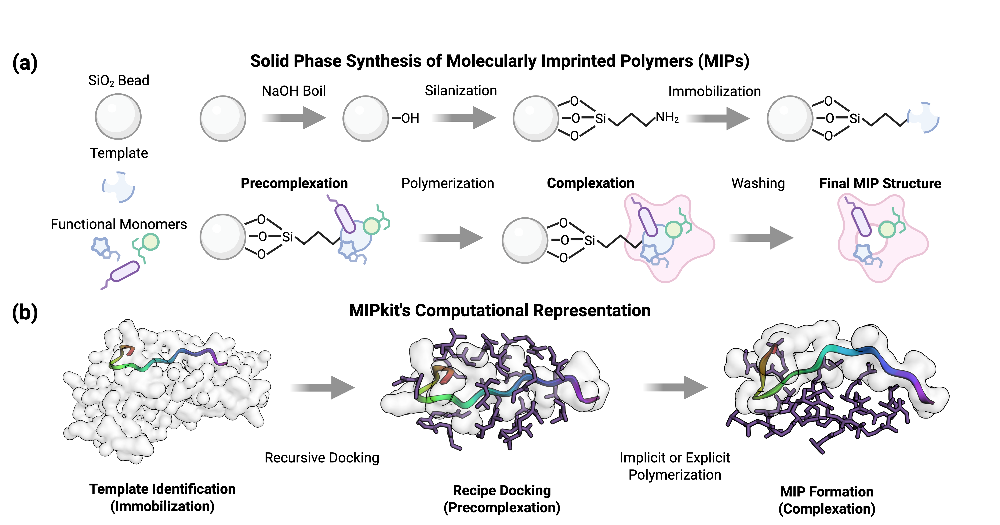

# MIPkit: Automated Screening, Docking, Precomplexation, and Complexation for Molecularly Imprinted Polymers
This package provides automated tools for screening and docking functional monomers onto epitopes and proteins. The entire functional monomer library can be found in <B> MIPkit/constants/fm-list.yaml </B>, or below. If you want to add any, make sure you fill out the tables completely, i.e., the functional monomer acronym, any equivalents you might use by mistake, SMILES codes, etc.<br><br>
<p align="center">

</p >
Beyond docking, this code can generate precomplexes about a target epitope. <B> -dock</B> applies recursive docking to a target, building out a theoretical precomplexation structure. Recipe order is randomized (or applied with a seed for repeatability), so calling the function several times should give a range of starting configurations to analyze. The precomplexes can then be polymerized using <B> -react</B>. Complexation can be done with or without a template present, to generate relevant <B>MIP</B> and <B>NIP</B> structures for rebinding and cross-reactivity simulations. 

### Citation

If you use this package or any of its constituents, please use the following citations of this package and its dependencies: 

```
@article{MIPkit,
    author = "Barrett, T. and Moldovean-Cioroianu, N.~S. and Altintas, Z.",
    title = "A digital twin for the in-silico screening, polymerization, and rebinding of Molecularly Imprinted Polymers",
    journal = "In Preparation",
    year = "2026"
}
```

### Python Dependencies
* Numpy
* Scipy
* Rich
* ACPYPE
* RDKit
* Setuptools
* Matplotlib
* pyyaml
* Pandas
* networkx

### Separately Installed Optional Dependencies
* Autodock Vina
* GNINA
* Openbabel
* Ambertools
* GROMACS

MIPkit's main functionality requires all optional dependencies to be installed; however, if you only want to use Python-based applications (visualization, recipe price estimation, etc.), MIPkit will function without them.

Once these are installed, update config.yaml and activate_XXX_venv.sh.

# Features

### Screening

    # Screen using GNINA or VINA
    MIPkit -screen -protein Example_protein.pdb -fms AAC BIS DMAA NIPAM ....

    # Screen using Gromacs
    MIPkit -gmxscreen -protein Example_protein.pdb -fms AAC BIS DMAA NIPAM ....

MIPkit automates the screening process, either through simple docking or molecular dynamics interactions. <b> -gmxscreen </b> will dock and simulate a single functional monomer (or list of monomers) against a given template, allowing high-throughput screening of FMs with only a single line of code. For comparison, it exports RDFs, LJ and Coulombic interactions, and H-Bond counts.

### Recursive Docking

    # From -fms
    MIPkit -dock -protein CD20-epitope.pdb -fms AMPSA 4 BAAPY 1 NIPAM 15 BIS 5

    # From a config
    MIPkit -dock -protein CD20-epitope.pdb -config cd20_complex.yaml

MIPkit will recursively dock MIP recipes to generate precomplexes that can be polymerized into MIPs and NIPs. <b>-dockmethod</b> can be used to switch between GNINA and VINA.

### Algorithm-Based Polymerization

    # MIP
    MIPkit -react -protein CD20-epitope.pdb -complex CD20-shuffle.pdb -cutoff 3.3 -gmxt short

    # NIP
    MIPkit -react -complex CD20-shuffle.pdb -cutoff 3.3 -gmxt short

MIPkit contains a novel RDkit-based algorithm to determine and apply new bonds. This permits the polymerization of an unprecedented variety of monomers, with the current FM library containing 98 FMs and crosslinkers. For implicit simulations, a bonding cutoff and probability determine polymerization events, while for explicit simulations, bonding and initiation cutoffs are used to apply bonding eligibility.  

### Interaction
    # MIP complex Interaction (with excess FMs)
    MIPkit -interact -cplx CD20-MIP.pdb -protein CD20-epitope-done.pdb -id -config cd20_complex.yaml

    # MIP Interaction (no loose FMs)
    MIPkit -react -cplx CD20-MIP.pdb -protein CD20-epitope-done.pdb -wash -id -config cd20_complex.yaml 

MIPkit will also run interactions between the polymerized structures and templates. To get a proper MIP structure, <b> -wash</b> should be applied to remove any unreacted FMs. <b> -id </b> is used in conjunction with the recipe outlined in the config yaml to decompose polymers into their constituent FMs to determine the per-species contributions of energies and H-Bond interactions.

### Price Estimation

    MIPkit -cost -fms AMPSA 1 AAC 10 BIS 5 NIPAM 20

MIPkit contains a simple price estimation tool for all recipes to give you a better idea of FM costs during recipe development. Using <b> -cost </b> with a recipe in the command line, or through <b> -config </b> will calculate cost directly in units EUR/mMol.

### Self Interaction
The code allows for self-interaction of the polymer chains, permitting the formation of complex structures and loops. This also allows us to generate hydrogel structures.

### Example Workflow

Please follow the links below to the quickstart section of the documentation : 
* [Caffeine](https://tjbarrett.dev/mipkit-documentation/quickstart/caffeine/) 
* [CD20](https://tjbarrett.dev/mipkit-documentation/quickstart/cd20/)

## Functional Monomer Library

| Functional Monomer                     | Acronym                | Vina    | gnina    | MIPkit (vinyl) |    Smiles   |
| ------------------                     | -------                | ------- | -------  | ------- |  ---------  |
| Acrylic Acid                           |   AAC                  |&#x2611; |&#x2611;  |&#x2611; | C=CC(=O)O |
| Acrylamide                             |   AAM                  |&#x2611; |&#x2611;  |&#x2611; | C=CC(=O)N |
| 4-Acryloylmorpholine                   |  ACMO                  |&#x2611; |&#x2611;  |&#x2611; | C=CC(=O)N1CCOCC1 |
| Acrylonitrile                          |   ACN                  |&#x2611; |&#x2611;  |&#x2611; | C=CC#N |
| Acrolein                               |  ACRO                  |&#x2611; |&#x2611;  |&#x2611; | C=CC=O |
| Aminoethyl methacrylate                |  AEMA                  |&#x2611; |&#x2611;  |&#x2611; | CC(=C)C(=O)OCCN |
| Aminoethyl methacrylamide              |  AEMAA                 |&#x2611; |&#x2611;  |&#x2611; | N(CCN)C(=O)C(=C)C |
| Allylamine                             |  ALLY                  |&#x2611; |&#x2611;  |&#x2611; | C=CCN |
| Allylpiperazine                        |  ALPP                  |&#x2611; |&#x2611;  |&#x2611; | C=CCN1CCNCC1 |
| Allyl Methacrylate                     |   AMA                  |&#x2611; |&#x2611;  |&#x2611; | CC(=C)C(=O)OCC=C |
| Acrylamido Methyl Propanesulfonic Acid |  AMPSA                 |&#x2611; |&#x2611;  |&#x2611; | CC(C)(CS(=O)(=O)O)NC(=O)C=C |
| Aminopropyl methacrylamide             |  APMA                  |&#x2611; |&#x2611;  |&#x2611; | CC(=C)C(=O)NCCCN |
| Aminopropyltriethoxysilane             |  APTES                 |&#x2611; |&#x2611;  |         | CCO\[Si\](CCCN)(OCC)OCC |
| Allylthiourea                          |  AT                    |&#x2611; |&#x2611;  |&#x2611; | C=CCNC(=S)N |
| p-Aminostyrene                         |  p-AS                  |&#x2611; |&#x2611;  |&#x2611; | C=CC1=CC=C(C=C1)N |
| Butyl acrylate                         |  BA                    |&#x2611; |&#x2611;  |&#x2611; | CCCCOC(=O)C=C |
| Bis(acrylamido)pyridine                |  BAAPy                 |&#x2611; |&#x2611;  |&#x2611; | C=CC(=O)NC1=NC(=CC=C1)NC(=O)C=C |
| 1,4-Bis(acryloyl)piperazine            |   BAPA                  |&#x2611; |&#x2611;  |&#x2611; | C=CC(=O)N1CCN(CC1)C(=O)C=C |
| Methylenebisacrylamide                 |   BIS                  |&#x2611; |&#x2611;  |&#x2611; | C=CC(=O)NCNC(=O)C=C |
| Butyl Methacrylate                     |  BMA                   |&#x2611; |&#x2611;  |&#x2611; | CCCCOC(=O)C(=C)C |
| Benzyl Methacrylate                    |  BZMA                  |&#x2611; |&#x2611;  |&#x2611; | CC(=C)C(=O)OCC1=CC=CC=C1 |
| Carboxybetaine Methacrylate            | CBMA                   |&#x2611; |&#x2611;  |&#x2611; | O=C(CC\[N+\](C)(C)CCOC(C(C)=C)=O)\[O-\] |
| Diallyl Carbonate                      |   DAC                  |&#x2611; |&#x2611;  |&#x2611; | C=CCOC(=O)OCC=C |
| Diallyl methylamine                    | DAMAS                  |&#x2611; |&#x2611;  |&#x2611; | CN(CC=C)CC=C |
| 2-(Diethylamino)ethyl acrylate         | DEAA                   |&#x2611; |&#x2611;  |&#x2611; | CCN(CC)CCOC(=O)C=C |
| Diethylamino ethyl methacrylate        | DEAEMA                 |&#x2611; |&#x2611;  |&#x2611; | CCN(CC)CCOC(=O)C(C)=C |
| Diethylene Glycol Dimethacrylate       | DEGDMA                 |&#x2611; |&#x2611;  |&#x2611; | CC(=C)C(=O)OCCOCCOC(=O)C(=C)C |
| 1,3-Diisopropoylbenzene                |  DIPB                  |&#x2611; |&#x2611;  |&#x2611; | CC(=C)C1=CC(=CC=C1)C(=C)C |
| N,N-Dimethylacrylamide                 | DMAA                   |&#x2611; |&#x2611;  |&#x2611; |  CN(C)C(=O)C=C |
| Dimethylamino ethyl methacrylate       | DMAEMA                 |&#x2611; |&#x2611;  |&#x2611; | CC(=C)C(=O)OCCN(C)C |
| Dimethylamino propyl methacrylamide    | DMAPMAA                |&#x2611; |&#x2611;  |&#x2611; | CN(C)CCCNC(=O)C(C)=C |
| m-Divinylbenzene                       |  m-DVB                 |&#x2611; |&#x2611;  |&#x2611; | C=CC1=CC(C=C)=CC=C1 |
| o-Divinylbenzene                       |  o-DVB                 |&#x2611; |&#x2611;  |&#x2611; | C=CC1=C(C=C)C=CC=C1 |
| p-Divinylbenzene                       |  p-DVB                 |&#x2611; |&#x2611;  |&#x2611; | C=CC1=CC=C(C=C)C=C1 |
| Ethylenebisacrylamide                  |  EBAM                  |&#x2611; |&#x2611;  |&#x2611; | C=CC(=O)NCCNC(=O)C=C |
| Ethylene glycol dimethacrylate         |  EGDMA                 |&#x2611; |&#x2611;  |&#x2611; | CC(=C)C(=O)OCCOC(=O)C(=C)C |
| Ethylene glycol dicyclopentenyl ether acrylate    |  EGDPEA     |&#x2611; |&#x2611;  |&#x2611; | C=CC(=O)OCCOC1CC2CC1C3C=CCC23 |
| Ethylene glycol methacylate phosphate  |  EGMP                  |&#x2611; |&#x2611;  |&#x2611; | CC(=C)C(=O)OCCOP(O)(O)=O |
| Ethylene glycol methyl ether methacrylate | EGMEM               |&#x2611; |&#x2611;  |&#x2611; | COCCOC(=O)C(C)=C |
| Ethylene glycol phenyl ether acrylate     | EGPEA               |&#x2611; |&#x2611;  |&#x2611; | C=CC(=O)OCCOc1ccccc1 |
| 2-Ethylstyrene                         |  2-ES                  |&#x2611; |&#x2611;  |&#x2611; | CCC1=CC=CC=C1C=C |
| 4-Ethylstyrene                         |  4-ES                  |&#x2611; |&#x2611;  |&#x2611; | CCC1=CC=C(C=C1)C=C |
| 2-Formylphenylboronic acid             | 2-FPBA                 |         |&#x2611;  |         | B(C1=CC=CC=C1C=O)(O)O |
| 3-Formylphenylboronic acid             | 3-FPBA                 |         |&#x2611;  |         | B(C1=CC(=CC=C1)C=O)(O)O |
| 4-Formylphenylboronic acid             | 4-FPBA                 |         |&#x2611;  |         | B(C1=CC=C(C=C1)C=O)(O)O |
| Furfuryl methacrylate                  |  FFMA                  |&#x2611; |&#x2611;  |&#x2611; | CC(=C)C(=O)OCc1ccco1 |
| Glycidyl methacrylate                  |   GMA                  |&#x2611; |&#x2611;  |&#x2611; | CC(=C)C(=O)OCC1CO1 |
| 2-Hydroxyethyl Acrylate                |  HEA                   |&#x2611; |&#x2611;  |&#x2611; | C=CC(=O)OCCO |
| Hydroxyethyl acrylamide                |  HEAA                  |&#x2611; |&#x2611;  |&#x2611; | C=CC(=O)NCCO |
| Hydroxyethyl methacrylate              |  HEMA                  |&#x2611; |&#x2611;  |&#x2611; | CC(=C)C(=O)OCCO |
| Hydroxypropyl methacrylamide           |  HPMA                  |&#x2611; |&#x2611;  |&#x2611; | CC(=C)C(=O)NCCCO |
| Isobutyltriethoxysilane                |  IPTS                  |&#x2611; |&#x2611;  |         | CCO\[Si\](CC(C)C)(OCC)OCC |
| Isobutyl acrylate                      |   IBA                  |&#x2611; |&#x2611;  |&#x2611; | CC(C)COC(=O)C=C |
| Isobutyl methacrylate                  |   IBMA                 |&#x2611; |&#x2611;  |&#x2611; | CC(C)COC(=O)C(C)=C |
| Itaconic Acid                          |    IA                  |&#x2611; |&#x2611;  |&#x2611; | C=C(CC(=O)O)C(=O)O |
| Methacrylic Acid                       |   MAA                  |&#x2611; |&#x2611;  |&#x2611; | CC(=C)C(=O)O |
| Methyl 2-acetamidoacrylate             |  MAAA                  |&#x2611; |&#x2611;  |&#x2611; | COC(=O)C(=C)NC(C)=O |
| Methacylic acid N-hydroxysyccinimide ester   |  MAHSE           |&#x2611; |&#x2611;  |&#x2611; | CC(=C)C(=O)ON1C(=O)CCC1=O |
| Methacryloyl L-aspartic acid           |  MALAA                 |&#x2611; |&#x2611;  |&#x2611; | CC(=C)C(=O)N\[C@@H\](CC(=O)O)C(=O)O |
| N,N,N-trimethyl-3-\[(2-methylacryloyl)amino\]propan-1-aminium |  MAPTAC  |&#x2611; |&#x2611;  |&#x2611; | CC(=C)C(=O)NCCC\[N+\](C)(C)C |
| Methacrylamide                         |   MAM                  |&#x2611; |&#x2611;  |&#x2611; | CC(=C)C(=O)N |
| 2-(methacryloyloxy)ethyl phosphate     |   MEP                  |&#x2611; |&#x2611;  |&#x2611; | CC(=C)C(=O)OCCOP(O)(=O)OCCOC(=O)C(C)=C |
| 4-Methacryloxyethyl trimellitic anhydride  |  4-META            |&#x2611; |&#x2611;  |&#x2611; | O1C(=O)c2c(ccc(c2)C(=O)OCCOC(=O)C(=C)C)C1=O |
| \[2-(Methacryloyloxy)ethyl\]trimethylammonium | METC            |&#x2611; |&#x2611;  |&#x2611; | CC(=C)C(=O)OCC\[N+\](C)(C)C |
| Maleic Acid                            |   MLA                  |&#x2611; |&#x2611;  |  | OOCC=CCOO |
| Methyl methacrylate                    |   MMA                  |&#x2611; |&#x2611;  |&#x2611; | CC(=C)C(=O)OC |
| 2-Methacryloyloxyethyl phosphorylcholine | MPC                  |&#x2611; |&#x2611;  |&#x2611; | CC(=C)C(=O)OCCOP(=O)(\[O-\])OCC\[N+\](C)(C)C |
| Methylacryloxyprolyl Trimethoxysilane  |  MPTS                  |&#x2611; |&#x2611;  |         | CO\[Si\](CCCOC(=O)C(C)=C)(OC)OC |
| 4-Methylstyrene                        |  4-MS                  |&#x2611; |&#x2611;  |&#x2611; | CC1=CC=C(C=C1)C=C |
| N-Isopropylacrylamide                  |  NIPAM                 |&#x2611; |&#x2611;  |&#x2611; | CC(C)NC(=O)C=C |
| N-(4-Ethenylphenyl)-N'-methylthiourea  |   NMT                  | &#x2611; |&#x2611; |&#x2611; | CNC(=S)NC1=CC=C(C=C1)C=C |
| N,O-Bismethacryloyl ethanolamine       |  NOBE                  |&#x2611; |&#x2611;  |&#x2611; | CC(=C)C(=O)NCCOC(=O)C(=C)C |
| N-Phenylacrylamide                     |   NPA                  |&#x2611; |&#x2611;  |&#x2611; | C=CC(=O)NC1=CC=CC=C1 |
| Phenyl Acrylamide                      |   PAM                  |&#x2611; |&#x2611;  |&#x2611; | C=C(C1=CC=CC=C1)C(=O)N |
| 1,4-Phenylene dimethacrylate           |  PDMA                  |&#x2611; |&#x2611;  |&#x2611; | CC(=C)C(=O)Oc1ccc(OC(=O)C(C)=C)cc1 |
| Pentaerythritol triacrylate            |  PE3A                  |&#x2611; |&#x2611;  |&#x2611; | C=CC(=O)OCC(CO)(COC(=O)C=C)COC(=O)C=C         |
| Pentaerythritol tetraacrylate          |  PE4A                  |&#x2611; |&#x2611;  |&#x2611; | C=CC(=O)OCC(COC(=O)C=C)(COC(=O)C=C)COC(=O)C=C |
| Phenyl methacrylate                    |   PMA                  |&#x2611; |&#x2611;  |&#x2611; | CC(=C)C(=O)Oc1ccccc1 |
| Propyl methacrylate                    |   PPMA                 |&#x2611; |&#x2611;  |&#x2611; | CCCOC(=O)C(C)=C |
| Pyrrole                                |  PY                    |&#x2611; |&#x2611;  |  | C1=CNC=C1 |
| 4-Vinylphenol                          |  PVP                   |&#x2611; |&#x2611;  |&#x2611; | C=CC1=CC=C(C=C1)O |
| Sulfobetaine Methacrylate              |  SBMA                  |&#x2611; |&#x2611;  |&#x2611; | CC(=C)C(=O)OCC\[N+\](C)(C)CCCS(=O)(=O)O |
| Phenylethene (Styrene)                 |  STYR                  |&#x2611; |&#x2611;  |&#x2611; | C=CC1=CC=CC=C1 |
| N-tert-Butylacrylamide                 |   TBA                  |&#x2611; |&#x2611;  |&#x2611; | CC(C)(C)NC(=O)C=C |
| 1-(4-Vinylphenyl)-3-(3,5-bis(trifluoromethyl)phenyl)urea | TBFM |&#x2611; |&#x2611;  |&#x2611; | C=CC1=CC=C(C=C1)NC(=O)NC2=CC(=CC(=C2)C(F)(F)F)C(F)(F)F |
| Tetraoxysilane                         |  TEOS                  |&#x2611; |&#x2611;  |         | \[H\]\[Si\](OCC)(OCC)OCC |
| Trifluoromethacrylic Acid              |  TFMAA                 |&#x2611; |&#x2611;  |&#x2611; | C=C(C(=O)O)C(F)(F)F |
| Trimethylolpropane dimethacrylate      |  TMPD                  |&#x2611; |&#x2611;  |&#x2611; | CCC(CO)(COC(=O)C(=C)C)COC(=O)C(=C)C         |
| Trimethylolpropane trimethacrylate     |  TRIM                  |&#x2611; |&#x2611;  |&#x2611; | CCC(COC(=O)C(=C)C)(COC(=O)C(=C)C)COC(=O)C(=C)C |
| Urocanic Acid                          |   UCA                  |&#x2611; |&#x2611;  |         | C1=C(NC=N1)/C=C/C(=O)O |
| Urocanic Acid Ethyl Ester              |  UCAEE                 |&#x2611; |&#x2611;  |         | CCOC(=O)/C=C/C1=CN=CN1 |
| Vinyl Acrylate                         |   VA                   |&#x2611; |&#x2611;  |&#x2611; | C=COC(=O)C=C |
| p-Vinylbenzoic Acid                    |  p-VBA                 |&#x2611; |&#x2611;  |&#x2611; | C=CC1=CC=C(C=C1)C(=O)O |
| Vinylbenzyl Chloride                   |  VBC                   |&#x2611; |&#x2611;  |&#x2611; | C=CC1=CC=C(C=C1)CCl |
| 9-Vinylcarbazole                       |  9-VC                  |&#x2611; |&#x2611;  |&#x2611; | C=Cn1c2ccccc2c3ccccc13 |
| N-Vinylcaprolactam                     |  NVCL                  |&#x2611; |&#x2611;  |&#x2611; | C=CN1CCCCCC1=O |
| N-Vinylformamide                       |  NVF                   |&#x2611; |&#x2611;  |&#x2611; | C=CNC=O |
| 1-vinylimidazole                       |  1-VI                  |&#x2611; |&#x2611;  |&#x2611; | C=CN1C=CN=C1 |
| 4,5-vinylimidazole                     |  45-VI                 |&#x2611; |&#x2611;  |&#x2611; | C=CC=1NC=NC1 |
| Vinyl Methacrylate                     |   VMA                  |&#x2611; |&#x2611;  |&#x2611; | CC(=C)C(=O)OC=C |
| 4-Vinylbenzlamine                      |  VNA                   |&#x2611; |&#x2611;  |&#x2611; | C=CC1=CC=C(C=C1)CN |
| 2-vinylpyridine                        |  2-VP                  |&#x2611; |&#x2611;  |&#x2611; | C=CC1=CC=CC=N1 |
| 4-vinylpyridine                        |  4-VP                  |&#x2611; |&#x2611;  |&#x2611; | C=CC1=CC=NC=C1 |
| Vinylphosphonic Acid                   |   VPA                  |&#x2611; |&#x2611;  |&#x2611; | C=CP(=O)(O)O |
| 2-vinylphenylboronic acid              | 2-VPBA                 |         |&#x2611;  |         | B(C1=CC=CC=C1C=C)(O)O |
| 3-vinylphenylboronic acid              | 3-VPBA                 |         |&#x2611;  |         | B(C1=CC(=CC=C1)C=C)(O)O |
| 4-vinylphenylboronic acid              | 4-VPBA                 |         |&#x2611;  |         | B(C1=CC=C(C=C1)C=C)(O)O |
| Vinyl pyrrolidone                      |   VPD                  |&#x2611; |&#x2611;  |&#x2611; | C=CN1CCCC1=O |


##

### To Do :
This list will be developed as features and bugs are submitted. If you have bugs, please open an issue. If you have suggestions, please open a discussion.

Current To Do List:
* RDkit-based topology generation
* Refactor from pseudo-functional to object-oriented
* Electropolymerization 
